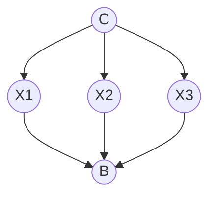

# 1

We know that $Pr(A,B) = Pr(A)Pr(B)$ and $Pr(A|B) = Pr(A)$ if $A$ and $B$ are
independent. We also know $Pr(A,B) = Pr(A|B)Pr(B)$. If we set $Pr(A) =
Pr(\alpha_1)$ and $Pr(B) = Pr(\alpha_2,\ldots,\alpha_n)$ then we can reach
$Pr(\alpha_1,\ldots,\alpha_n) =
Pr(\alpha_1|\alpha_2,\ldots,\alpha_n)Pr(\alpha_2,\ldots,\alpha_n)$ and thus
$Pr(\alpha_1,\ldots,\alpha_n|\beta) =
Pr(\alpha_1|\alpha_2,\ldots,\alpha_n|\beta)Pr(\alpha_2,\ldots,\alpha_n|\beta)$.
Recursively applying this logic on the second probability,
$Pr(\alpha_2,\ldots,\alpha_n|\beta)$, we reach the final result that
$Pr(\alpha_1,\ldots,\alpha_n|\beta) = Pr(\alpha_1|\alpha_2, \ldots, \alpha_n,
\beta)Pr(\alpha_2|\alpha_3,\ldots,\alpha_n,\beta)\ldots Pr(\alpha_n|\beta)$.

# 2

### Variables

- $O$: Oil is present
- $G$: Natural gas is present
- $P$: Positive test result

### What we know

- $P(O) = 0.5$
- $P(G) = 0.2$
- $P(\lnot O, \lnot G) = 0.3$

- $P(P|O) = 0.9$
- $P(P|G) = 0.3$
- $P(P|\lnot O, \lnot G) = 0.1$

### What we need to find

$P(O|P)$

Using Bayes' Theorem:

$P(O|P) = \frac{P(P|O)|P(O)}{P(P)} = \frac{0.9\cdot 0.5}{P(P)}$

$P(P) = P(P\mid O)P(O) + P(P\mid G)P(G) + P(P\mid \lnot O, \lnot G)P(\lnot O,
\lnot G)$

$P(P) = 0.9\cdot 0.5 + 0.3\cdot 0.2 + 0.1\cdot 0.3 = 0.54$

So $P(O\mid P) = \frac{0.9\cdot 0.5}{0.54} = 0.8\overline{3}$

# 3

Here heads is 1 and tails is 0.

| $Pr(C=a)$        | $Pr(C=b)$        | $Pr(C=c)$        |
| ---------------- | ---------------- | ---------------- |
| $0.\overline{3}$ | $0.\overline{3}$ | $0.\overline{3}$ |

|       | $Pr(X_1=0\mid C)$ | $Pr(X_1=1\mid C)$ |
| ----- | ----------------- | ----------------- |
| $C=a$ | $0.8$             | $0.2$             |
| $C=b$ | $0.6$             | $0.4$             |
| $C=c$ | $0.2$             | $0.8$             |

|       | $Pr(X_2=0\mid C)$ | $Pr(X_2=1\mid C)$ |
| ----- | ----------------- | ----------------- |
| $C=a$ | $0.8$             | $0.2$             |
| $C=b$ | $0.6$             | $0.4$             |
| $C=c$ | $0.2$             | $0.8$             |

|       | $Pr(X_3=0\mid C)$ | $Pr(X_3=1\mid C)$ |
| ----- | ----------------- | ----------------- |
| $C=a$ | $0.8$             | $0.2$             |
| $C=b$ | $0.6$             | $0.4$             |
| $C=c$ | $0.2$             | $0.8$             |

|                 | $Pr(B=0\mid X_1, X_2, X_3)$ | $Pr(B=1\mid X_1, X_2, X_3)$ |
| --------------- | --------------------------- | --------------------------- |
| $X_1=X_2=X_3=1$ | 0                           | 1                           |
| $X_1=X_2=X_3=0$ | 0                           | 1                           |
| $else$          | 1                           | 0                           |

# 4

### 1.

- $I(A, \emptyset, BE)$
- $I(B, \emptyset, AC)$
- $I(C, A, BDE)$
- $I(D, AB, CE)$
- $I(E, B, ACDFG)$
- $I(F, CD, ABE)$
- $I(G, F, ABCDEH)$
- $I(H, EF, ABCDG)$

### 2.

### 3.

$Pr(a,b,c,d,e,f,g,h) = Pr(A)Pr(B)Pr(C\mid A)Pr(D\mid A,B)Pr(E\mid B)Pr(F\mid
C,D)Pr(G\mid F)Pr(H\mid E,F)$

### 4.

$Pr(A=1, B=1) = Pr(A=1)Pr(B=1)$ (because $A$ and $B$ are independent) so
$Pr(A=1,B=1) = 0.2\cdot 0.7 = 0.14$. $A$ and $E$ are also independent so we can
say $Pr(E=0,A=0) = Pr(E=0)Pr(A=0) = (Pr(E=0\mid B=0)Pr(B=0) + Pr(E=0\mid
B=1)Pr(B=1))Pr(A=0) = (0.1\cdot 0.3 + 0.9\cdot 0.7)\cdot 0.8 = 0.66\cdot 0.8 =
0.528$

# 5

1. $\alpha = \{\lnot A, B\} = \{A = F, B = T\}$
2. $Pr(\alpha) = 0.3 + 0.1 + 0.4 = 0.8$
3. |            | $A$ $B$ | $Pr(A, B\mid \alpha)$ |
   | ---------- | ------- | --------------------- |
   | $\omega_0$ | T T     | 0.375                 |
   | $\omega_1$ | T F     | 0                     |
   | $\omega_2$ | F T     | 0.125                 |
   | $\omega_3$ | F F     | 0.5                   |
4. $Pr(A \Rightarrow \lnot B \mid \alpha) = Pr(A = F) = 0.1 + 0.4 = 0.5$
