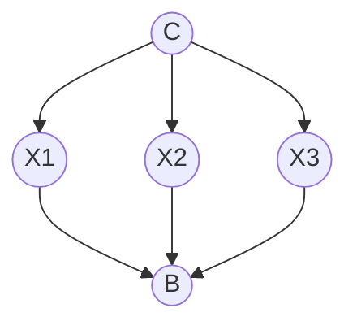

# 1

We know that $Pr(A,B) = Pr(A)Pr(B)$ and $Pr(A|B) = Pr(A)$ if $A$ and $B$ are
independent. We also know $Pr(A,B) = Pr(A|B)Pr(B)$. If we set $Pr(A) =
Pr(\alpha_1)$ and $Pr(B) = Pr(\alpha_2,\ldots,\alpha_n)$ then we can reach
$Pr(\alpha_1,\ldots,\alpha_n) =
Pr(\alpha_1|\alpha_2,\ldots,\alpha_n)Pr(\alpha_2,\ldots,\alpha_n)$ and thus
$Pr(\alpha_1,\ldots,\alpha_n|\beta) =
Pr(\alpha_1|\alpha_2,\ldots,\alpha_n|\beta)Pr(\alpha_2,\ldots,\alpha_n|\beta)$.
Recursively applying this logic on the second probability,
$Pr(\alpha_2,\ldots,\alpha_n|\beta)$, we reach the final result that
$Pr(\alpha_1,\ldots,\alpha_n|\beta) = Pr(\alpha_1|\alpha_2, \ldots, \alpha_n,
\beta)Pr(\alpha_2|\alpha_3,\ldots,\alpha_n,\beta)\ldots Pr(\alpha_n|\beta)$.

# 3

Here heads is 1 and tails is 0.

| $Pr(C=a)$        | $Pr(C=b)$        | $Pr(C=c)$        |
| ---------------- | ---------------- | ---------------- |
| $0.\overline{3}$ | $0.\overline{3}$ | $0.\overline{3}$ |

|       | $Pr(X_1=0\mid C)$ | $Pr(X_1=1\mid C)$ |
| ----- | ----------------- | ----------------- |
| $C=a$ | $0.8$             | $0.2$             |
| $C=b$ | $0.6$             | $0.4$             |
| $C=c$ | $0.2$             | $0.8$             |

|       | $Pr(X_2=0\mid C)$ | $Pr(X_2=1\mid C)$ |
| ----- | ----------------- | ----------------- |
| $C=a$ | $0.8$             | $0.2$             |
| $C=b$ | $0.6$             | $0.4$             |
| $C=c$ | $0.2$             | $0.8$             |

|       | $Pr(X_3=0\mid C)$ | $Pr(X_3=1\mid C)$ |
| ----- | ----------------- | ----------------- |
| $C=a$ | $0.8$             | $0.2$             |
| $C=b$ | $0.6$             | $0.4$             |
| $C=c$ | $0.2$             | $0.8$             |

|                 | $Pr(B=0\mid X_1, X_2, X_3)$ | $Pr(B=1\mid X_1, X_2, X_3)$ |
| --------------- | --------------------------- | --------------------------- |
| $X_1=X_2=X_3=1$ | 0                           | 1                           |
| $X_1=X_2=X_3=0$ | 0                           | 1                           |
| $else$          | 1                           | 0                           |
