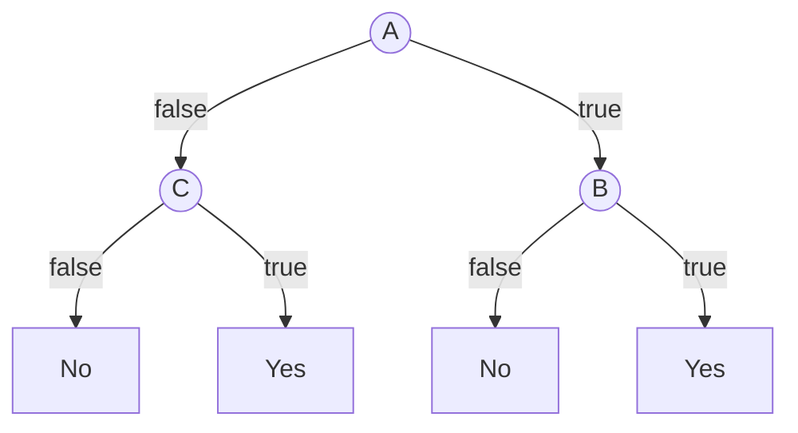

# 1.

$P(A=t) = \frac{11}{22}$

$ENT(A) = -0.5\log_2(0.5) - 0.5\log_2(0.5) = 1$

$P(B=t) = \frac{14}{22}$

$ENT(B) = -0.\overline{36} \log_2(0.\overline{36}) - 0.\overline{63}
\log_2(0.\overline{63}) \approx 0.9457$

$P(C=t) = \frac{7}{22}$

$ENT(C) = -0.3\overline{18} \log_2(0.3\overline{18}) - 0.6\overline{81}
\log_2(0.6\overline{81}) \approx 0.9024$

