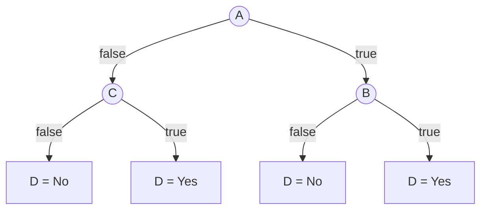
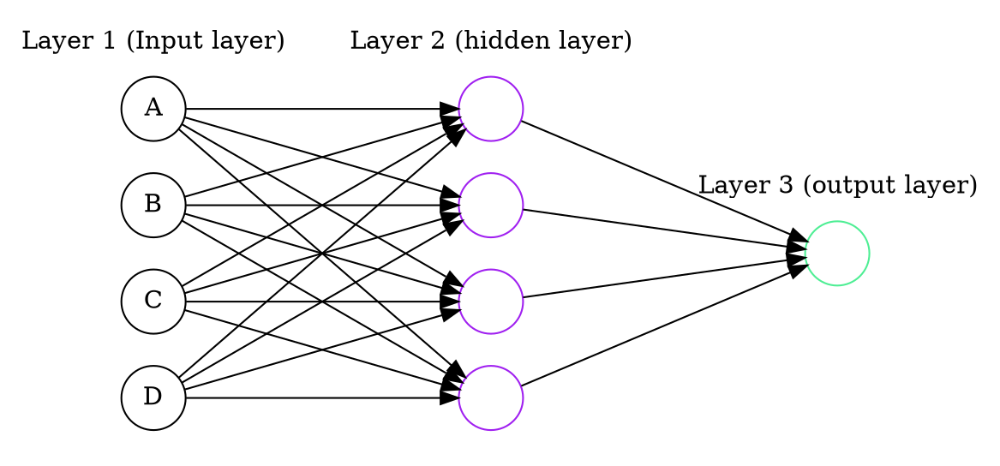
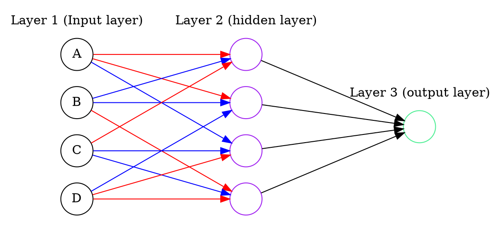
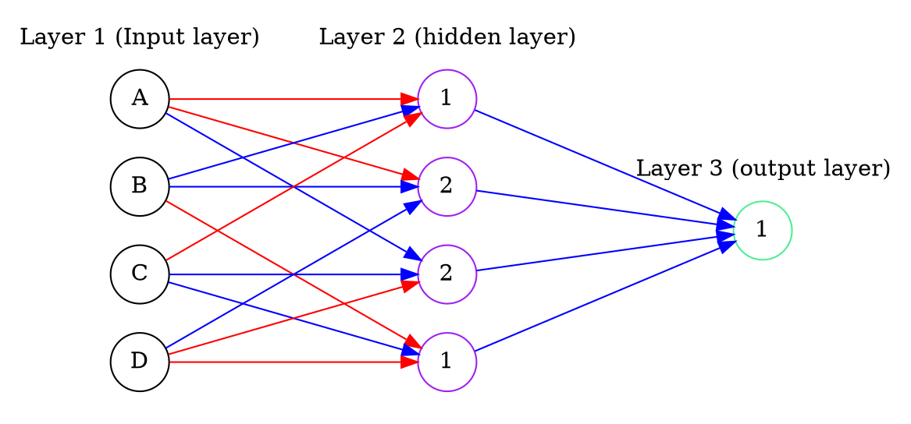

# 1.

$P(A=t) = \frac{11}{22}$

$ENT(A) = -0.5\log_2(0.5) - 0.5\log_2(0.5) = 1$

$P(B=t) = \frac{14}{22}$

$ENT(B) = -0.\overline{36} \log_2(0.\overline{36}) - 0.\overline{63}
\log_2(0.\overline{63}) \approx 0.9457$

$P(C=t) = \frac{7}{22}$

$ENT(C) = -0.3\overline{18} \log_2(0.3\overline{18}) - 0.6\overline{81}
\log_2(0.6\overline{81}) \approx 0.9024$

We need a place to start, and we can choose $A$ since it has the highest
entropy, and thus we can have a higher possible loss in entropy (information
gain) if we start here.

Branching off of $A=t$ we have:

$ENT(C\mid A=t) = -0.\overline{36} \log_2(0.\overline{36}) - 0.\overline{63}
\log_2(0.\overline{63}) \approx 0.9457$

$ENT(B\mid A=t) = -0.\overline{36} \log_2(0.\overline{36}) - 0.\overline{63}
\log_2(0.\overline{63}) \approx 0.9457$

These entropies are the same, meaning our information gain is the same, so we
will just choose $B$ next because it simplifies the decision tree.

With $A=f$ we have:

$ENT(C\mid A=f) = -0.\overline{72} \log_2(0.\overline{72}) - 0.\overline{27}
\log_2(0.\overline{27}) \approx 0.8454$

$ENT(B\mid A=f) = -0.\overline{36} \log_2(0.\overline{36}) - 0.\overline{63}
\log_2(0.\overline{63}) \approx 0.9457$

Now we have a greater information gain by choosing $C$ (it has a lower
conditional entropy) so this is our most discriminating attribute when $A=f$.

# 2.

We want to find $(A \lor \lnot B) \oplus (\lnot C \lor D)$ using the following
neural network:

 

We will denote inputs as `true = 1` and `false = 0`.

First we will simplify the original equation using $x \oplus y = (\overline{x}
\land y) \lor (x \land \overline{y})$.

$$(A \lor \lnot B) \oplus (\lnot C \lor D)$$

$$= (\overline{(A \lor \lnot B)} \land (\lnot C \lor D)) \lor ((A \lor \lnot B)
\land \overline{(\lnot C \lor D)})$$

$$ = ((\lnot A \land B) \land (\lnot C \lor D)) \lor ((A \lor \lnot B) \land (C
\land \lnot D))$$

$$= (\lnot A \land B \land \lnot C) \lor (\lnot A \land B \land D) \lor (A \land
C \land \lnot D) \lor (\lnot B \land C \land \lnot D)$$

Now we can generate a neural network. We assign each hidden layer node to a term
where each input to the node is given a weight of 1 if the variable in that term
is positive, and a weight of -1 if the variable is negated. We will use blue to
denote a weight of 1 and red to denote a weight of -1.

 

So this is our network so far. Since each term is a set of literals connected
with conjunctions (`AND`), we need each hidden layer node to output 1 only if
all given inputs are `true`. This happens if and only if the sum of the given
weights is equal to the amount of positive variable inputs. This is because the
hidden layer nodes use the step function, which is 1 when the sum of the inputs
are above or equal to the threshold, and 0 otherwise. The terms themselves are
positive (not negated) so we will just keep their output weights at 1 and the
output node threshold will be 1 since we only need 1 of the hidden layer nodes
to evaluate to `true` (the terms are connected with disjunctions (`OR`)). Our
finished network looks like this:

