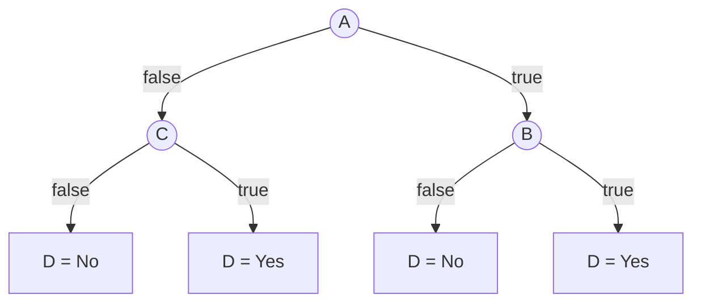

# 1.

$P(A=t) = \frac{11}{22}$

$ENT(A) = -0.5\log_2(0.5) - 0.5\log_2(0.5) = 1$

$P(B=t) = \frac{14}{22}$

$ENT(B) = -0.\overline{36} \log_2(0.\overline{36}) - 0.\overline{63}
\log_2(0.\overline{63}) \approx 0.9457$

$P(C=t) = \frac{7}{22}$

$ENT(C) = -0.3\overline{18} \log_2(0.3\overline{18}) - 0.6\overline{81}
\log_2(0.6\overline{81}) \approx 0.9024$

We need a place to start, and we can choose $A$ since it has the highest
entropy, and thus we can have a higher possible loss in entropy (information
gain) if we start here.

Branching off of $A=t$ we have:

$ENT(C\mid A=t) = -0.\overline{36} \log_2(0.\overline{36}) - 0.\overline{63}
\log_2(0.\overline{63}) \approx 0.9457$

$ENT(B\mid A=t) = -0.\overline{36} \log_2(0.\overline{36}) - 0.\overline{63}
\log_2(0.\overline{63}) \approx 0.9457$

These entropies are the same, meaning our information gain is the same, so we
will just choose $B$ next because it simplifies the decision tree.

With $A=f$ we have:

$ENT(C\mid A=f) = -0.\overline{72} \log_2(0.\overline{72}) - 0.\overline{27}
\log_2(0.\overline{27}) \approx 0.8454$

$ENT(B\mid A=f) = -0.\overline{36} \log_2(0.\overline{36}) - 0.\overline{63}
\log_2(0.\overline{63}) \approx 0.9457$

Now we have a greater information gain by choosing $C$ (it has a lower
conditional entropy) so this is our most discriminating attribute when $A=f$.

